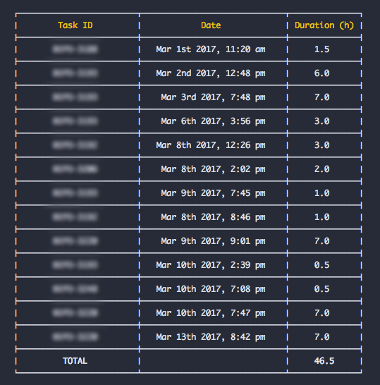

# node-jira-worklog-cli (experimental)

`node-jira-worklog-cli` is an interactive terminal tool to calculate Worklogs for a given period range and report a total sum.
It was created for personal usage, therefore is not published on [npm](https://www.npmjs.com/), but I thought I should share in case someone finds it handy.

## Install

Download and install dependencies:

```sh
$ git clone https://github.com/georapbox/node-jira-worklog-cli.git
$ cd node-jira-worklog-cli/
$ npm install
```

Run:
```sh
$ npm start
```

You can install the package globally, by navigating to the project's root folder and running:
```sh
$ npm install -g
```

Then you can run the tool from anywhere by running:
```sh
$ node-jira-worklog-cli
```

## Screenshot


